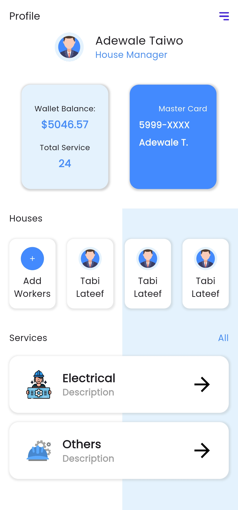

# flutter_ui_task_3

Flutter Ui Task 3

## Description

Many Widgets used in this screen, some example: AppBar, Text, Container, Scaffold, Stack, Positioned, Row, Column and i used a container with backgroung image properites.

## Screen View
