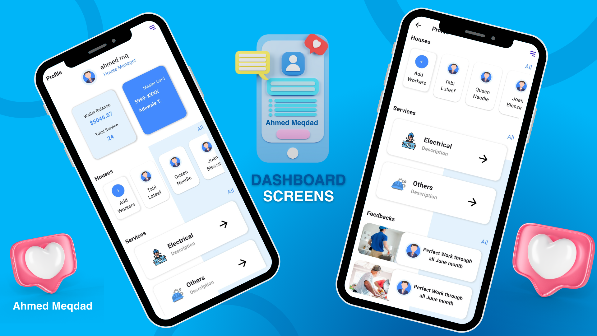

# flutter_ui_task_3

Flutter Ui Task 3

## Description

Many Widgets used in this screen, some example: AppBar, Text, Container, Scaffold, Stack, Positioned, Row, Column and i used a container with backgroung image properites.
Packges: Google Font Packge used to replace app font.

## Updates

build Auth screens(login & siginup) with many TextFields with navigation between login & signup,
add custom textField with controller for each textField to handle all status user data entered.

add a condition for email textField shlould contain (@) & end with (.com)
add a condition for password textField shlould contain at least one of any character.

Add Helper folder to manage constatnts in the app as Colors, TextStyle, Iocn, function showMessage
use Navigator to navigate from splash screen to dashboard screen, and use the ScaffoldMessenger to show the snackBar whin click in Menu Icon.
Use InkWell Widget to Enable tap ont the any widget we need, and use the onTap inside these widget.
apply the custom widget for the screen, update widgets used as Card, listTile, stack.
make a simple splash screen with linear Graident and button, when click on the button, navigate to dashboard sceen>

## Splash Screen

## Auth Screens

## Dahsborad Screens

